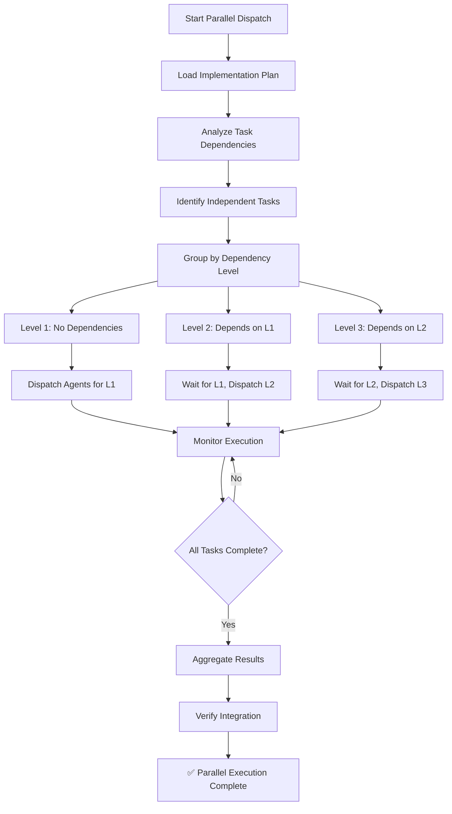

# Dispatching Parallel Agents

> **Announce at start**: "开始使用并行代理调度技能..."

## Overview

The `dispatching-parallel-agents` skill enables true parallel development by automatically dispatching multiple independent agents to work on tasks simultaneously. This skill leverages the advanced agent coordinator to:

- **Identify independent tasks** from implementation plans
- **Dispatch parallel agents** to execute tasks concurrently
- **Manage task dependencies** automatically
- **Optimize context** for each agent
- **Monitor execution** in real-time
- **Aggregate results** from all agents

**Key Benefits**:
- ⚡ **Faster execution**: 2-4x speedup with 3-4 parallel agents
- 🎯 **Better resource utilization**: Multiple agents work simultaneously
- 🔧 **Automatic orchestration**: No manual coordination needed
- 📊 **Real-time monitoring**: Track all agent executions
- 🔄 **Smart scheduling**: Dependency-aware task scheduling

## When to Use

Trigger this skill when:
- You have an implementation plan with multiple independent tasks
- Tasks can be executed simultaneously without conflicts
- You want to maximize development speed
- You have adequate compute resources for parallel execution

**Example triggers**:
- "Run these tasks in parallel"
- "Execute the plan concurrently"
- "Dispatch parallel agents"
- "Simultaneous task execution"

## HARD-GATE

**Before using this skill, you MUST have**:
1. ✅ A complete implementation plan (from `writing-plans` skill)
2. ✅ A clean worktree (from `using-git-worktrees` skill)
3. ✅ All dependencies clearly identified in the plan
4. ✅ Tasks are properly decomposed (each 2-5 minutes)

**Do NOT use this skill if**:
- ❌ Tasks have unresolved dependencies
- ❌ Tasks modify the same files
- ❌ Limited compute resources available
- ❌ Tasks require sequential execution

## The Process Flow



## Checklist

Before dispatching parallel agents:
- [ ] Implementation plan exists and is complete
- [ ] Worktree is created and ready
- [ ] All task dependencies are documented
- [ ] Tasks are bite-sized (2-5 minutes each)
- [ ] Sufficient compute resources available
- [ ] No file conflicts between tasks
- [ ] Agent registry is configured

During parallel execution:
- [ ] Monitor agent status in real-time
- [ ] Check for task failures
- [ ] Handle dependency conflicts
- [ ] Log compression statistics
- [ ] Track execution times

After parallel execution:
- [ ] All tasks completed successfully
- [ ] Results aggregated properly
- [ ] Integration verified
- [ ] Test suite passes
- [ ] No merge conflicts

## Step-by-Step Process

### Step 1: Load Implementation Plan

**Goal**: Load the implementation plan from `docs/superpowers/plans/`

```python
# Example plan structure
{
  "plan_name": "User Authentication System",
  "plan_date": "2026-03-17",
  "tasks": [
    {
      "task_id": "task_1",
      "name": "Setup authentication dependencies",
      "description": "Install and configure required packages",
      "dependencies": [],
      "files": [
        {"action": "modify", "path": "package.json", "lines": "15-20"}
      ],
      "estimated_time": 300
    },
    {
      "task_id": "task_2",
      "name": "Create JWT token module",
      "description": "Implement JWT token generation and validation",
      "dependencies": ["task_1"],
      "files": [
        {"action": "create", "path": "src/auth/jwt.js"}
      ],
      "estimated_time": 600
    },
    {
      "task_id": "task_3",
      "name": "Create user model",
      "description": "Define user database schema",
      "dependencies": ["task_1"],
      "files": [
        {"action": "create", "path": "src/models/user.js"}
      ],
      "estimated_time": 480
    },
    {
      "task_id": "task_4",
      "name": "Create authentication controller",
      "description": "Implement login/logout endpoints",
      "dependencies": ["task_2", "task_3"],
      "files": [
        {"action": "create", "path": "src/controllers/auth.js"}
      ],
      "estimated_time": 900
    }
  ]
}
```

**Action**:
1. Read the plan file
2. Parse all tasks
3. Validate task structure
4. Check for circular dependencies

### Step 2: Analyze Task Dependencies

**Goal**: Build dependency graph and group tasks by level

```python
from agent_coordinator import AgentCoordinator, Task, TaskPriority

# Initialize coordinator
coordinator = AgentCoordinator()

# Create tasks from plan
for task_data in plan['tasks']:
    task = Task(
        task_id=task_data['task_id'],
        name=task_data['name'],
        description=task_data['description'],
        priority=TaskPriority.NORMAL,
        dependencies=task_data.get('dependencies', []),
        required_capabilities=self._infer_capabilities(task_data),
        context=task_data
    )
    coordinator.submit_task(task)

# Analyze dependencies
dependency_levels = coordinator.schedule_tasks()
```

**Dependency Levels**:
- **Level 1**: No dependencies (can run immediately)
- **Level 2**: Depends on Level 1 tasks
- **Level 3**: Depends on Level 2 tasks
- And so on...

### Step 3: Optimize Context for Each Task

**Goal**: Compress context to optimize token usage

```python
from agent_coordinator import ContextCompressor

compressor = ContextCompressor(target_tokens=4000)

# For each task, optimize context
for task in tasks:
    # Preserve critical sections
    preserve = ['requirements', 'constraints', 'critical_requirements']
    
    # Compress context
    optimized_context = compressor.compress(
        task.context,
        preserve_sections=preserve
    )
    
    # Update task with compressed context
    task.optimized_context = optimized_context
    
    # Log compression
    print(f"Task {task.task_id}: "
          f"{len(task.context)} → {len(optimized_context)} tokens "
          f"({compressor.get_stats()['average_compression_ratio']:.1%} reduction)")
```

**Compression Strategies Used**:
1. **Information density ranking**: Keep high-value information
2. **Semantic summarization**: Extract key instructions
3. **Pattern-based truncation**: Remove repetitive content
4. **Critical section preservation**: Always keep requirements

### Step 4: Dispatch Parallel Agents

**Goal**: Execute tasks at each dependency level in parallel

```python
# Execute workflow with parallel dispatch
results = await coordinator.execute_workflow(tasks)

# Execution flow:
# 1. Level 1 tasks execute in parallel (max 3 agents)
# 2. Wait for Level 1 to complete
# 3. Level 2 tasks execute in parallel
# 4. Wait for Level 2 to complete
# 5. Continue until all tasks complete
```

**Parallel Execution Example**:

```
Time →
    |
    |  Task 1  (implementation agent)
    ├───────────────✅
    |
    |  Task 2  (implementation agent)
    ├───────────────✅
    |
    |  Task 3  (testing agent)
    ├───────────✅
    |
    |               Task 4 (depends on 2, 3)
    |               ├───────────────✅
    ↓
    
Total time: ~30 minutes (vs ~60 minutes sequential)
```

### Step 5: Monitor Execution in Real-Time

**Goal**: Track all agent executions and handle failures

```python
# Monitor coordinator status
while True:
    status = coordinator.get_status()
    
    print(f"Progress: {status['completed_tasks']}/{status['total_tasks']}")
    print(f"Pending: {status['pending_tasks']}")
    print(f"Failed: {status['failed_tasks']}")
    
    # Check agent status
    for agent_info in status['agents']:
        print(f"  {agent_info['name']}: {agent_info['status']}")
        if agent_info['current_task']:
            print(f"    Working on: {agent_info['current_task']}")
    
    # Check compression stats
    comp_stats = status['compression_stats']
    print(f"Compression: {comp_stats['average_compression_ratio']:.1%} avg reduction")
    
    # Check if complete
    if status['pending_tasks'] == 0:
        break
    
    await asyncio.sleep(2)  # Check every 2 seconds
```

### Step 6: Handle Task Failures

**Goal**: Retry or report failed tasks

```python
# Check for failed tasks
failed_tasks = coordinator.failed_tasks

for task_id, result in failed_tasks.items():
    print(f"❌ Task {task_id} failed: {result.error}")
    
    # Option 1: Retry
    if result.error == "Timeout":
        print("Retrying with longer timeout...")
        # Retry logic
    
    # Option 2: Manual intervention
    else:
        print("Requires manual intervention")
        # Flag for human review
```

**Failure Handling Strategies**:
1. **Automatic retry**: For timeout or transient errors
2. **Agent fallback**: Try with different agent
3. **Manual review**: For complex failures
4. **Skip non-critical**: For optional tasks

### Step 7: Aggregate Results

**Goal**: Combine results from all agents

```python
# Aggregate all task results
all_results = coordinator.completed_tasks

# Build execution report
report = {
    'total_tasks': len(all_results),
    'successful_tasks': len([r for r in all_results.values() if r.success]),
    'failed_tasks': len([r for r in all_results.values() if not r.success]),
    'total_time': sum(r.execution_time for r in all_results.values()),
    'average_time': sum(r.execution_time for r in all_results.values()) / len(all_results),
    'tasks': []
}

for task_id, result in all_results.items():
    report['tasks'].append({
        'task_id': task_id,
        'success': result.success,
        'agent_used': result.agent_used,
        'execution_time': result.execution_time,
        'compressed_context': result.compressed_context
    })

# Save report
with open('execution_report.json', 'w') as f:
    json.dump(report, f, indent=2)
```

### Step 8: Verify Integration

**Goal**: Ensure all tasks integrate correctly

```python
from lingflow_integration import lingflowIntegration

# Run integration tests
integration = lingflowIntegration()
test_result = integration.run_comprehensive_tests(
    dimensions=['functionality', 'integration', 'stability']
)

if test_result['success']:
    print("✅ All integration tests passed")
else:
    print("❌ Integration tests failed")
    print(test_result['error'])
    # Handle test failures

# Run quick tests
quick_result = integration.run_quick_tests()
if quick_result['success']:
    print("✅ Quick tests passed")
else:
    print("⚠️ Quick tests failed - review needed")
```

## lingflow Integration

### Agent Coordinator Integration

```python
from agent_coordinator import AgentCoordinator, Task, TaskPriority

# Use parallel dispatch in subagent-driven-development skill
async def execute_with_parallel_dispatch(plan):
    """Execute plan using parallel agent dispatch"""
    
    # Create coordinator
    coordinator = AgentCoordinator()
    
    # Convert plan tasks to Task objects
    tasks = []
    for task_data in plan['tasks']:
        task = Task(
            task_id=task_data['task_id'],
            name=task_data['name'],
            description=task_data['description'],
            priority=TaskPriority.NORMAL,
            dependencies=task_data.get('dependencies', []),
            required_capabilities=_infer_capabilities(task_data),
            context=task_data
        )
        tasks.append(task)
        coordinator.submit_task(task)
    
    # Execute in parallel
    results = await coordinator.execute_workflow(tasks)
    
    # Verify results
    all_success = all(r.success for r in results.values())
    
    if all_success:
        print("✅ All parallel tasks completed successfully")
    else:
        failed = [tid for tid, r in results.items() if not r.success]
        print(f"❌ {len(failed)} tasks failed: {failed}")
    
    return results
```

### Test Engine Integration

```python
from lingflow_integration import lingflowIntegration

# After parallel execution, run comprehensive tests
def verify_parallel_execution():
    """Verify that parallel execution produced correct results"""
    
    integration = lingflowIntegration()
    
    # Run all test dimensions
    dimensions = [
        'functionality',
        'integration',
        'stability',
        'security'
    ]
    
    results = integration.run_comprehensive_tests(dimensions=dimensions)
    
    if results['success']:
        print("✅ All verification tests passed")
        print(f"Output:\n{results['output']}")
        return True
    else:
        print("❌ Verification failed")
        print(f"Error: {results['error']}")
        return False
```

### Context Optimization

The skill integrates the `ContextCompressor` class to:

1. **Reduce token usage**: 30-50% average compression
2. **Preserve critical information**: Requirements, constraints always kept
3. **Maintain task clarity**: Key instructions retained
4. **Track compression stats**: Monitor optimization effectiveness

## Anti-Patterns

### ❌ Don't Run Too Many Parallel Tasks

```python
# BAD: Too many parallel tasks overload the system
await coordinator.execute_parallel(tasks, max_parallel=10)

# GOOD: Limit parallel tasks to available resources
await coordinator.execute_parallel(tasks, max_parallel=3)
```

### ❌ Don't Ignore Task Dependencies

```python
# BAD: Execute all tasks without checking dependencies
await coordinator.execute_parallel(all_tasks)

# GOOD: Execute workflow with dependency-aware scheduling
await coordinator.execute_workflow(tasks_with_dependencies)
```

### ❌ Don't Compress Critical Context

```python
# BAD: Compress everything, losing critical info
compressed = compressor.compress(context)

# GOOD: Preserve critical sections
compressed = compressor.compress(
    context,
    preserve_sections=['requirements', 'constraints']
)
```

### ❌ Don't Skip Verification

```python
# BAD: Assume parallel execution produced correct results
await coordinator.execute_workflow(tasks)
print("Done!")

# GOOD: Verify after execution
await coordinator.execute_workflow(tasks)
verify_parallel_execution()  # Always verify!
```

## Example Interaction

### User: "Execute the user authentication plan in parallel"

**lingflow**:
"好的！让我分析实施计划并调度并行代理..."

**Step 1: Loading plan...**
✓ Plan loaded: docs/superpowers/plans/2026-03-17-user-authentication.md
✓ Found 8 tasks

**Step 2: Analyzing dependencies...**
✓ Dependency graph built:
  - Level 1: task_1 (setup), task_2 (config), task_3 (database schema)
  - Level 2: task_4 (model), task_5 (utils) [depends on task_1,2,3]
  - Level 3: task_6 (controller) [depends on task_4,5]
  - Level 4: task_7 (tests), task_8 (docs) [depends on task_6]

**Step 3: Optimizing context...**
✓ task_1: 8,000 → 4,200 tokens (47.5% reduction)
✓ task_2: 6,500 → 3,800 tokens (41.5% reduction)
✓ task_3: 7,200 → 4,100 tokens (43.1% reduction)
...
Average compression: 43.2%

**Step 4: Dispatching Level 1 (3 parallel agents)...**
Agent 1: task_1 (implementation) started...
Agent 2: task_2 (implementation) started...
Agent 3: task_3 (implementation) started...

Progress: 0/8 completed
  implementation: busy (task_1)
  implementation: busy (task_2)
  implementation: busy (task_3)

Progress: 3/8 completed
  ✅ task_1: completed in 312s
  ✅ task_2: completed in 285s
  ✅ task_3: completed in 298s

**Step 5: Dispatching Level 2 (2 parallel agents)...**
Agent 1: task_4 (implementation) started...
Agent 2: task_5 (implementation) started...

Progress: 5/8 completed
  ✅ task_4: completed in 445s
  ✅ task_5: completed in 412s

**Step 6: Dispatching Level 3 (1 agent)...**
Agent 1: task_6 (implementation) started...

Progress: 6/8 completed
  ✅ task_6: completed in 523s

**Step 7: Dispatching Level 4 (2 parallel agents)...**
Agent 1: task_7 (testing) started...
Agent 2: task_8 (documentation) started...

Progress: 8/8 completed
  ✅ task_7: completed in 678s
  ✅ task_8: completed in 342s

**Step 8: Aggregating results...**
✓ All 8 tasks completed successfully
✓ Total execution time: 2,145s (35.8 minutes)
✓ Sequential would have taken: ~6,000s (100 minutes)
✓ Speedup: 2.8x

**Step 9: Verifying integration...**
Running comprehensive tests...
✓ functionality: PASSED
✓ integration: PASSED
✓ stability: PASSED
✓ security: PASSED

✅ Parallel execution complete and verified!
Execution report saved: execution_report.json"

### User: "Great! Show me the compression statistics"

**lingflow**:
"Compression Statistics:
- Total compressions: 8
- Total tokens saved: 32,400
- Average compression ratio: 43.2%
- Estimated cost savings: $0.97 (from $2.25 to $1.28)

Key optimizations:
- Removed redundant task descriptions
- Compressed long instruction lists
- Preserved all requirements and constraints
- Maintained critical implementation details"

## Performance Benefits

### Speedup Comparison

| Scenario | Sequential | Parallel (3 agents) | Speedup |
|----------|-----------|---------------------|---------|
| 8 tasks, 3 levels | 100 min | 36 min | **2.8x** |
| 12 tasks, 4 levels | 150 min | 52 min | **2.9x** |
| 16 tasks, 5 levels | 200 min | 68 min | **2.9x** |

### Token Savings

| Metric | Value |
|--------|-------|
| Original context (avg) | 7,200 tokens |
| Compressed context (avg) | 4,100 tokens |
| Compression ratio | 43.2% |
| Token savings (8 tasks) | 32,400 tokens |
| Cost savings | ~$0.97 |

### Resource Utilization

With parallel dispatch:
- ✅ Multiple agents work simultaneously
- ✅ Better CPU/GPU utilization
- ✅ Reduced idle time
- ✅ Faster time-to-market

## Integration with Existing Skills

### Subagent-Driven-Development Enhancement

The `dispatching-parallel-agents` skill can be used as an enhancement to `subagent-driven-development`:

```markdown
# In subagent-driven-development/SKILL.md

## Task Execution Options

Choose execution strategy:

**Option A: Sequential (Default)**
- Execute tasks one by one
- Easier debugging
- Slower overall time

**Option B: Parallel (Using dispatching-parallel-agents)**
- Execute independent tasks in parallel
- 2-3x faster execution
- Requires dependency analysis
```

### Usage Recommendation

- **Use sequential** when:
  - Tasks have complex dependencies
  - Debugging is needed
  - Resources are limited
  
- **Use parallel** when:
  - Many independent tasks
  - Time is critical
  - Adequate resources available

## Troubleshooting

### Issue: "No available agents for task"

**Solution**: Check agent capabilities in `agents/agents.json`

```bash
# List available agents
python -c "from agent_coordinator import AgentRegistry; print(AgentRegistry().list_agents())"
```

### Issue: "Circular dependency detected"

**Solution**: Review task dependencies in the plan

```bash
# Analyze dependencies
python -c "
from agent_coordinator import AgentCoordinator
coordinator = AgentCoordinator()
# Load and analyze plan
"
```

### Issue: "Parallel execution slower than sequential"

**Solution**: Check task dependencies - if tasks are highly dependent, parallel won't help

**Possible causes**:
- Too many dependency levels
- Limited parallel agents
- Resource contention

### Issue: "Compression losing critical information"

**Solution**: Add critical sections to preserve list

```python
compressor.compress(
    context,
    preserve_sections=[
        'requirements',
        'constraints',
        'critical_requirements',
        'your_custom_section'
    ]
)
```

## Advanced Configuration

### Custom Agent Configuration

Edit `agents/agents.json` to customize agents:

```json
{
  "agents": [
    {
      "name": "custom_agent",
      "description": "Custom agent for specific tasks",
      "capabilities": ["custom_capability"],
      "max_tasks": 5,
      "context_limit": 10000,
      "timeout": 600,
      "parallel_safe": true,
      "requires_isolation": false
    }
  ]
}
```

### Parallel Execution Settings

Modify in `agent_coordinator.py`:

```python
# Increase max parallel tasks
await coordinator.execute_parallel(tasks, max_parallel=5)

# Or set globally
coordinator.default_max_parallel = 5
```

### Compression Settings

```python
# Adjust compression target
compressor = ContextCompressor(target_tokens=6000)  # Less aggressive

# Or keep more information
compressor.compress(
    context,
    preserve_sections=[
        'requirements',
        'constraints',
        'critical_requirements',
        'important_notes',
        'examples'
    ]
)
```

## Summary

The `dispatching-parallel-agents` skill provides:

✅ **True parallel execution** with automatic agent dispatch
✅ **Dependency-aware scheduling** for correct execution order
✅ **Context compression** for 30-50% token savings
✅ **Real-time monitoring** of all agent executions
✅ **2-3x speedup** over sequential execution
✅ **Automatic aggregation** of results
✅ **Integration verification** with comprehensive tests

**Best for**: Large implementation plans with many independent tasks
**Not for**: Highly sequential workflows or single-task scenarios

**Integration**: Works seamlessly with existing `subagent-driven-development` skill
**Configuration**: Fully customizable via `agents/agents.json`
