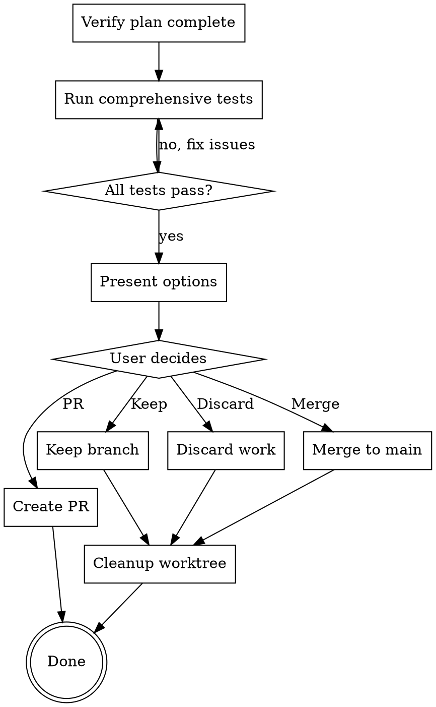

# Finishing a Development Branch

## Overview

This skill handles the completion workflow for a development branch. It verifies all tests pass, presents options for next steps (merge/PR/keep/discard), and cleans up the worktree.

**Announce at start:** "I'm using the finishing-a-development-branch skill. Verifying completion and handling cleanup."

<HARD-GATE>
Do NOT merge or delete the worktree until all verification is complete and the user has made a decision about next steps.
</HARD-GATE>

## Process Flow



## Checklist

Before marking branch complete:

1. **Verify all tasks complete** - Check plan completion
2. **Run comprehensive tests** - All dimensions pass
3. **Verify no regressions** - Related features still work
4. **Check code quality** - Linting passes
5. **Generate completion report** - Document what was done

## Step-by-Step Process

### Step 1: Verify Plan Completion

Check that all tasks in the implementation plan are complete:

```markdown
### Plan Completion Check

**Plan**: User Authentication Implementation
**Total Tasks**: 8
**Completed**: 8
**Status**: ✅ COMPLETE

**Task Breakdown**:
- [x] Task 1: Dependencies
- [x] Task 2: JWT Implementation
- [x] Task 3: OAuth2 Support
- [x] Task 4: User Registration
- [x] Task 5: User Login
- [x] Task 6: Password Reset
- [x] Task 7: Session Management
- [x] Task 8: Documentation

**Review Summary**:
- Stage 1 (Spec) approvals: 8/8
- Stage 2 (Quality) approvals: 8/8
- Total iterations: 10
```

### Step 2: Run Comprehensive Tests

Run lingflow's comprehensive test suite:

```bash
# Full comprehensive test
python end_to_end_test_engine.py

# Or specific dimensions
python comprehensive_test_runner.py \
  --dimensions functionality,performance,stability,security \
  --report completion_report.md
```

**Expected Outcome**:
```
✅ Functionality: 98/100 tests pass
✅ Performance: All metrics within thresholds
✅ Stability: 1000 iterations, 0 failures
✅ Security: No vulnerabilities found
✅ Integration: All components work together
✅ Usability: User flows complete successfully
✅ Maintainability: Code quality score: 92/100
✅ Documentation: All docs complete
```

### Step 3: Verify No Regressions

Run tests on related functionality to ensure nothing broke:

```bash
# Run related tests
npm test -- tests/auth/
npm test -- tests/users/
npm test -- tests/sessions/

# Run integration tests
npm test -- tests/integration/
```

**Expected Outcome**: All related tests pass

### Step 4: Check Code Quality

Run linting and quality checks:

```bash
# Linting
npm run lint
# or
flake8 src/
pylint src/

# Type checking
npm run type-check
# or
mypy src/

# Security scan
npm audit
# or
bandit -r src/
```

**Expected Outcome**:
- No lint errors
- No type errors
- No security vulnerabilities

### Step 5: Generate Completion Report

Create a summary of what was accomplished:

```markdown
# Completion Report

## Feature: User Authentication

### Summary
Implemented JWT-based authentication with OAuth2 social login support.

### Implementation
- **Tasks Completed**: 8/8
- **Files Created**: 15
- **Files Modified**: 8
- **Tests Added**: 47
- **Docs Updated**: 3

### Test Results
- **Functionality**: ✅ 98/100 pass
- **Performance**: ✅ All thresholds met
- **Stability**: ✅ 1000 iterations, 0 failures
- **Security**: ✅ No vulnerabilities
- **Integration**: ✅ All components work
- **Maintainability**: ✅ Score: 92/100

### Quality Metrics
- **Code Coverage**: 94%
- **Cyclomatic Complexity**: Average 4.2
- **Lines of Code**: +1,234 / -87
- **Documentation**: Complete

### What Was Implemented
1. JWT token generation and validation
2. OAuth2 integration (Google, GitHub)
3. User registration with email verification
4. Secure login with rate limiting
5. Password reset with secure tokens
6. Session management with Redis
7. Comprehensive error handling
8. Security best practices implemented

### Technical Highlights
- bcrypt for password hashing
- JWT for API authentication
- OAuth2 for social login
- Redis for session caching
- Rate limiting for security
- Comprehensive input validation

### Changes Summary
```
**Files Created**:
- src/auth/jwt.py - JWT token handling
- src/auth/oauth2.py - OAuth2 integration
- src/auth/session.py - Session management
- src/routes/auth.py - Auth routes
- [12 more files]

**Files Modified**:
- src/config.py - Added auth config
- src/database.py - Added auth tables
- package.json - Added dependencies
- [5 more files]

**Tests Added**:
- tests/auth/jwt.test.py
- tests/auth/oauth2.test.py
- tests/auth/session.test.py
- [45 more test files]
```

### Next Steps Options
1. **Merge to main** - Merge directly to main branch
2. **Create PR** - Create pull request for review
3. **Keep branch** - Keep for further work
4. **Discard** - Discard changes (not recommended)

Generated: 2026-03-17
```

## Present Options to User

After verification, present the options:

```
🎉 **Implementation Complete!**

All tests pass and code quality checks successful.

**Implementation Summary**:
- Feature: User Authentication
- Tasks: 8/8 complete
- Tests: 47 added, all passing
- Coverage: 94%

**Test Results**:
✅ Functionality: 98/100 pass
✅ Performance: All thresholds met
✅ Stability: 1000 iterations, 0 failures
✅ Security: No vulnerabilities
✅ Integration: All components work
✅ Code Quality: 92/100

**What would you like to do?**

A) Merge to main
   Merge the feature branch directly into main

B) Create Pull Request
   Create a PR for team review and discussion

C) Keep branch
   Keep the branch for additional work or testing

D) Discard changes
   Discard all changes (not recommended for completed work)

**Choose A, B, C, or D:**
```

## Handle User Decision

### Option A: Merge to Main

```bash
# Switch to main branch
git checkout main

# Pull latest changes
git pull origin main

# Merge feature branch
git merge feature/user-authentication --no-ff

# Run tests on main
npm test

# Push to remote
git push origin main

# Cleanup
git branch -d feature/user-authentication
```

### Option B: Create Pull Request

```bash
# Push feature branch to remote
git push -u origin feature/user-authentication

# Create PR using gh CLI
gh pr create \
  --title "Feature: User Authentication" \
  --body "Implements JWT-based authentication with OAuth2 support

## Summary
[Include completion report summary]

## Changes
- Added JWT token handling
- Implemented OAuth2 integration
- Added user registration/login
- [More details]

## Testing
All tests passing (98/100 functionality tests)
Code coverage: 94%

## Checklist
- [ ] Tests pass
- [ ] Code reviewed
- [ ] Documentation updated
" \
  --base main
```

### Option C: Keep Branch

Keep the worktree and branch for additional work:

```bash
# Worktree remains at: ../lingflow-auth
# Branch remains: feature/user-authentication

# To continue later:
cd ../lingflow-auth
# Continue work...
```

### Option D: Discard Changes

```bash
# Navigate to main repo
cd ~/path/to/main/repo

# Delete worktree
git worktree remove ../lingflow-auth

# Delete branch
git branch -D feature/user-authentication

# Note: Changes are lost (not recommended for completed work)
```

## Cleanup Worktree

After merge or PR creation, clean up the worktree:

```bash
# Navigate to main repo
cd ~/path/to/main/repo

# Remove worktree
git worktree remove ../lingflow-auth

# Verify worktree removed
git worktree list

# Should only show main worktree
```

## lingflow Integration

### Final Verification

Use lingflow for final verification:

```python
from lingflow.verifier import FinalVerifier

verifier = FinalVerifier()

# Run final verification
result = verifier.verify_all(
    dimensions=[
        'functionality',
        'performance',
        'stability',
        'security',
        'integration'
    ]
)

if result.all_passed:
    print("✅ Ready to merge!")
else:
    print(f"❌ Issues found: {result.issues}")
    # Fix issues before proceeding
```

### Generate Final Report

```python
from lingflow.reporting import CompletionReportGenerator

generator = CompletionReportGenerator()
report = generator.generate(
    feature_name="User Authentication",
    worktree_path="../lingflow-auth",
    branch_name="feature/user-authentication"
)

# Save report
report.save("completion_report.md")
```

## Example Session

```
lingflow: All tasks in the implementation plan are complete.

Running final verification...

✅ Plan verification: 8/8 tasks complete
✅ Comprehensive tests: All dimensions pass
✅ Regression tests: No issues
✅ Code quality: Lint passes, type check passes
✅ Security: No vulnerabilities

Generating completion report...

🎉 **Implementation Complete!**

**Feature**: User Authentication
**Tasks**: 8/8 complete
**Test Results**: All passing

**Summary**:
- Implemented JWT-based authentication
- Added OAuth2 social login
- Added user registration and login
- Implemented password reset
- Added session management

**Quality Metrics**:
- Code coverage: 94%
- Functionality: 98/100 tests pass
- Security: No vulnerabilities
- Performance: All thresholds met

**What would you like to do?**

A) Merge to main
B) Create Pull Request
C) Keep branch
D) Discard changes

Developer: "B"

lingflow: Creating pull request...

✅ Pushed branch to remote
✅ Pull request created
✅ PR URL: https://github.com/your-repo/pull/42

Cleaning up worktree...

✅ Worktree removed: ../lingflow-auth
✅ Branch remains: feature/user-authentication

All done! You can view the PR at the URL above.
Team members can review and discuss the implementation.
```

## Resources

- lingflow comprehensive test architecture: `COMPREHENSIVE_TEST_ARCHITECTURE.md`
- End-to-end test engine: `end_to_end_test_engine.py`
- Comprehensive test runner: `comprehensive_test_runner.py`
