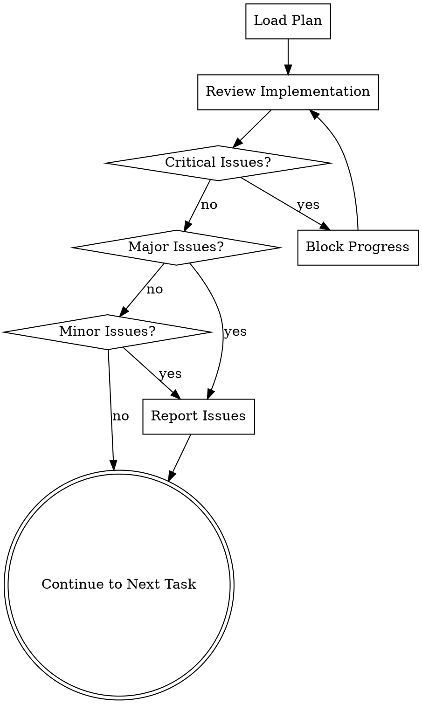

# Requesting Code Review

## Overview

This skill performs code review during implementation, checking against the plan and reporting issues by severity. Critical issues block progress before moving to the next task.

**Announce at start:** "I'm using the requesting-code-review skill. Reviewing implementation against the plan."

<HARD-GATE>
Do NOT proceed to the next task if critical issues are found. All critical issues must be resolved first.
</HARD-GATE>

## When to Use

Trigger this skill:
- After completing a task in the implementation plan
- Before moving to the next task
- As part of the subagent-driven-development workflow

## Review Process



## Issue Severity Levels

### 🔴 CRITICAL
**Blocks progress**. Must fix before proceeding.

Examples:
- Missing required functionality
- Tests not passing
- Security vulnerabilities
- Data corruption risk
- Breaking existing functionality

**Action**: Stop, fix critical issues, re-review.

### 🟡 MAJOR
**Should fix** before proceeding, but not a hard blocker.

Examples:
- Code quality issues
- Performance problems
- Missing error handling
- Inconsistent naming
- Poor documentation

**Action**: Note issues, fix before final commit.

### 🟢 MINOR
**Nice to fix** but can proceed.

Examples:
- Minor formatting issues
- Extra whitespace
- Comments could be clearer
- Minor optimizations

**Action**: Note for future cleanup.

## Checklist

Review each implementation against:

- [ ] **Plan Compliance** - Does it match the plan?
- [ ] **Functionality** - Does it work as specified?
- [ ] **Tests** - Are tests passing?
- [ ] **Code Quality** - Is code clean and maintainable?
- [ ] **Security** - Are there vulnerabilities?
- [ ] **Performance** - Is performance acceptable?
- [ ] **Documentation** - Is code documented?
- [ ] **Error Handling** - Are errors handled properly?

## Review Framework

### 1. Plan Compliance Review

Check that implementation matches the plan:

```markdown
### Plan Compliance

**Task**: Task N: [Task Name]
**Plan Requirements**:
- [ ] File `src/file.py` created
- [ ] Function `calculate_x()` implemented
- [ ] Test `test_calculate_x()` passes
- [ ] Commit message: "feat: add X calculation"

**Implementation Status**:
✅ Files created as specified
✅ Functions implemented as planned
✅ Tests pass
✅ Commit message matches

**Verdict**: ✅ PASS
```

### 2. Functionality Review

Verify the implementation works correctly:

```markdown
### Functionality

**Test Results**:
```
npm test -- tests/calculator.test.js
PASS tests/calculator.test.js
  ✓ should calculate X correctly
  ✓ should handle edge cases
  ✓ should validate inputs
```

**Manual Verification**:
✅ Tested with valid inputs - works correctly
✅ Tested with edge cases - works correctly
✅ Tested with invalid inputs - proper error handling

**Verdict**: ✅ PASS
```

### 3. Code Quality Review

Check code quality:

```markdown
### Code Quality

**Linting**:
```
eslint src/calculator.js
✅ No errors
✅ 0 warnings
```

**Metrics**:
- Cyclomatic complexity: 3 (good)
- Function length: 15 lines (good)
- Variable naming: Clear and consistent
- Comments: Appropriate amount

**Verdict**: ✅ PASS
```

### 4. Security Review

Check for security issues:

```markdown
### Security

**Security Scan**:
```
npm audit
found 0 vulnerabilities
```

**Code Review**:
✅ Input validation in place
✅ No hardcoded secrets
✅ Proper error handling
✅ No eval() or similar dangerous functions

**Verdict**: ✅ PASS
```

### 5. Performance Review

Check performance characteristics:

```markdown
### Performance

**Benchmark**:
```
calculateX() with 1000 items: 0.023s
calculateX() with 10000 items: 0.198s
```

**Analysis**:
✅ Linear scaling (O(n)) as expected
✅ No memory leaks detected
✅ No unnecessary computations

**Verdict**: ✅ PASS
```

## LingFlow Integration

### Automated Review Enhancement

Use LingFlow's code analyzer to enhance review:

```python
from lingflow.code_analyzer import CodeAnalyzer

analyzer = CodeAnalyzer('.')
report = analyzer.analyze_dimensions([
    'code_quality',
    'security',
    'performance',
    'error_handling'
])

if report.issues:
    # Convert to review format
    for issue in report.issues:
        severity = determine_severity(issue)
        print(f"{severity} {issue.message}")
```

### Comprehensive Testing

Run comprehensive tests as part of review:

```python
from lingflow.test_engine import TestRunner

runner = TestRunner()
results = runner.run_dimensions(['functionality', 'stability'])

for result in results:
    if not result.passed:
        print(f"❌ Test failed: {result.name}")
        print(f"   Error: {result.error}")
```

## Report Template

### ✅ Clean Review

```markdown
# Code Review Report

**Task**: Task 3: Implement JWT Token Generation
**Plan**: User Authentication Implementation
**Reviewer**: LingFlow Code Reviewer
**Date**: 2026-03-17

---

## Summary

✅ **APPROVED** - Implementation meets all requirements

---

## Detailed Review

### Plan Compliance ✅
- All files created as specified
- All functions implemented
- Tests pass
- Commit message matches plan

### Functionality ✅
- Tests: 5/5 passing
- Manual verification: All scenarios work
- Edge cases: Handled correctly

### Code Quality ✅
- Linting: No errors, 0 warnings
- Complexity: Low
- Readability: High
- Documentation: Complete

### Security ✅
- Security audit: No vulnerabilities
- Input validation: In place
- Secret handling: Proper
- Error messages: Don't leak info

### Performance ✅
- Response time: 0.012s (< 0.1s threshold)
- Scaling: Linear as expected
- Memory: 2MB usage (acceptable)

---

## Issues Found
None

---

## Recommendations
None

---

## Verdict
✅ **APPROVED** - Ready to proceed to next task

---

**End of Review**
```

### 🟡 Review with Issues

```markdown
# Code Review Report

**Task**: Task 4: Implement User Login
**Plan**: User Authentication Implementation
**Reviewer**: LingFlow Code Reviewer
**Date**: 2026-03-17

---

## Summary

⚠️ **CONDITIONAL APPROVAL** - Minor issues to address

---

## Detailed Review

### Plan Compliance ✅
- All files created as specified
- All functions implemented
- Tests pass
- Commit message matches plan

### Functionality ✅
- Tests: 8/8 passing
- Manual verification: All scenarios work
- Edge cases: Handled correctly

### Code Quality ⚠️
- Linting: No errors, 2 warnings
  - Line 45: Unused variable 'temp'
  - Line 67: Magic number 3600 should be constant
- Complexity: Medium (could be simplified)
- Readability: Good
- Documentation: Complete

### Security ✅
- Security audit: No vulnerabilities
- Input validation: In place
- Secret handling: Proper
- Rate limiting: Could be stricter (100 req/min is high)

### Performance ✅
- Response time: 0.034s (< 0.1s threshold)
- Scaling: Linear as expected
- Memory: 3MB usage (acceptable)

---

## Issues Found

### Major Issues 🟡

1. **Magic Number**
   - **Location**: `src/auth/login.js:67`
   - **Issue**: Using magic number 3600 (seconds in 1 hour)
   - **Severity**: Major
   - **Recommendation**: Define as constant `TOKEN_EXPIRY_SECONDS = 3600`

2. **Rate Limiting**
   - **Location**: `src/auth/login.js:23`
   - **Issue**: Rate limit of 100 req/min may be too high
   - **Severity**: Major
   - **Recommendation**: Consider reducing to 20 req/min for security

### Minor Issues 🟢

1. **Unused Variable**
   - **Location**: `src/auth/login.js:45`
   - **Issue**: Variable 'temp' is declared but never used
   - **Severity**: Minor
   - **Recommendation**: Remove unused variable

---

## Recommendations

1. Fix magic number by defining constants
2. Review and potentially lower rate limit
3. Remove unused variable

---

## Verdict
⚠️ **CONDITIONAL APPROVAL** - Minor issues to address before final commit

You may proceed to next task, but fix these issues before final commit.

---

**End of Review**
```

### 🔴 Review with Critical Issues

```markdown
# Code Review Report

**Task**: Task 5: Implement Password Reset
**Plan**: User Authentication Implementation
**Reviewer**: LingFlow Code Reviewer
**Date**: 2026-03-17

---

## Summary

🔴 **REJECTED** - Critical issues must be fixed

---

## Detailed Review

### Plan Compliance ✅
- All files created as specified
- All functions implemented
- **Tests**: 3/5 passing (2 failures)
- Commit message matches plan

### Functionality 🔴
- **Tests**: 2/5 failing
  - ❌ test_password_reset_invalid_token
  - ❌ test_password_reset_expired_token
- Manual verification: Basic flows work, edge cases fail
- Edge cases: Not handled correctly

### Code Quality 🟡
- Linting: No errors, 3 warnings
- Complexity: High (needs refactoring)
- Readability: Could be better

### Security 🔴
- **Security audit**: 2 vulnerabilities
  - 🔴 Reset token not properly hashed
  - 🔴 No rate limiting on reset endpoint

### Performance ✅
- Response time: 0.045s (< 0.1s threshold)

---

## Issues Found

### Critical Issues 🔴

1. **Test Failures**
   - **Location**: `tests/auth/reset.test.js`
   - **Issue**: 2 tests failing
   - **Severity**: Critical
   - **Details**:
     - Invalid token not detected
     - Expired token not detected
   - **Action**: Fix before proceeding

2. **Security: Token Not Hashed**
   - **Location**: `src/auth/reset.js:34`
   - **Issue**: Reset token stored in plain text
   - **Severity**: Critical
   - **Risk**: Token leakage could allow unauthorized resets
   - **Action**: Hash tokens with bcrypt

3. **Security: No Rate Limiting**
   - **Location**: `src/auth/reset.js:15`
   - **Issue**: No rate limiting on password reset endpoint
   - **Severity**: Critical
   - **Risk**: Could be abused for email spam or denial of service
   - **Action**: Add rate limiting

### Major Issues 🟡

1. **High Complexity**
   - **Location**: `src/auth/reset.js`
   - **Issue**: Function complexity too high (cyclomatic: 12)
   - **Severity**: Major
   - **Recommendation**: Refactor into smaller functions

---

## Recommendations

1. **STOP** - Fix critical issues before proceeding
2. Hash reset tokens with bcrypt
3. Add rate limiting to reset endpoint
4. Fix failing tests (invalid and expired token handling)
5. Refactor to reduce complexity

---

## Verdict
🔴 **REJECTED** - Critical issues must be fixed

Do NOT proceed to next task. Fix critical issues and request review again.

---

**End of Review**
```

## Follow-up Actions

### After Critical Review

```markdown
🔴 **Critical Issues Found**

The implementation has critical issues that must be fixed before proceeding.

**Critical Issues**:
1. Test failures (2/5 tests failing)
2. Security: Reset token not hashed
3. Security: No rate limiting

**Required Actions**:
1. Hash reset tokens with bcrypt
2. Add rate limiting to reset endpoint
3. Fix failing tests (invalid/expired token handling)

Please fix these issues and request review again.
```

### After Major/Minor Review

```markdown
⚠️ **Review Complete with Issues**

Implementation is approved, but there are issues to address before final commit.

**Issues to Fix**:
- [ ] Define constant for magic number 3600
- [ ] Review rate limit (100 req/min)
- [ ] Remove unused variable 'temp'

You may proceed to next task, but fix these issues before final commit.
```

### After Clean Review

```markdown
✅ **Review Complete - Approved**

Implementation meets all requirements.

**Summary**:
- Plan compliance: ✅
- Functionality: ✅
- Code quality: ✅
- Security: ✅
- Performance: ✅

Proceeding to next task...
```

## Example Session

```
LingFlow: Task 4 complete. Running code review...

Loading implementation plan...
Reviewing Task 4: User Login...

[Running checks]

✅ Plan compliance: PASS
✅ Functionality: PASS (8/8 tests)
⚠️ Code quality: Minor issues
✅ Security: PASS
✅ Performance: PASS

**Review Summary**:
- Critical issues: 0
- Major issues: 0
- Minor issues: 2

⚠️ **CONDITIONAL APPROVAL**

**Minor Issues**:
1. Magic number 3600 at src/auth/login.js:67
   → Should be defined as constant

2. Unused variable 'temp' at src/auth/login.js:45
   → Should be removed

You may proceed to next task, but fix these issues before final commit.

Continue to next task? (Y/n)
```

## Resources

- LingFlow code analyzer: Use for automated code quality checks
- Comprehensive test runner: Use for testing verification
- Security scanner: Use for vulnerability detection
- Linting tools: ESLint, Flake8, Pylint
