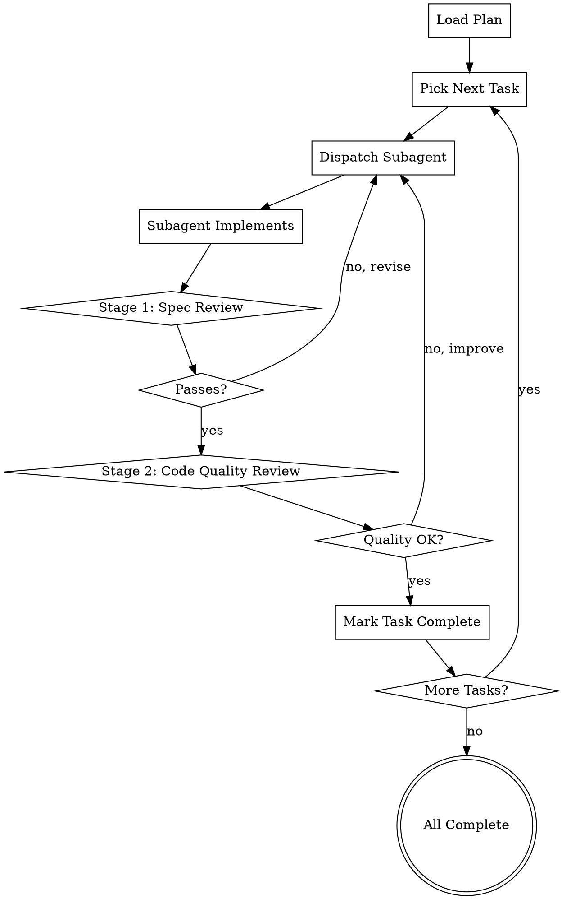

# Subagent Driven Development

## Overview

This skill enables rapid development by dispatching a fresh subagent for each task, with two-stage review to ensure quality. Each subagent works independently, reviewed for spec compliance first, then code quality.

**Announce at start:** "I'm using the subagent-driven-development skill. Dispatching fresh subagent per task with two-stage review."

<HARD-GATE>
Do NOT skip the two-stage review process. Every task must be reviewed for spec compliance AND code quality before marking complete.
</HARD-GATE>

## The Process Flow



## Execution Modes

### Sequential vs Parallel Execution

By default, this skill uses **sequential execution** - each task is completed one at a time with two-stage review before moving to the next.

However, when tasks are independent and have no dependencies, you can use **parallel execution** by switching to the `dispatching-parallel-agents` skill.

**When to Use Parallel Execution:**
- Tasks have no dependencies on each other
- Multiple independent components need implementation
- Same type of work across different files/modules
- Time-critical development with large task count

**When to Use Sequential Execution:**
- Tasks have dependencies (later tasks depend on earlier ones)
- Complex inter-component relationships
- Need for iterative feedback between tasks
- Uncertain architecture requiring sequential validation

### Switching to Parallel Execution

When you identify independent tasks, explicitly switch to parallel mode:

```
I'm switching to parallel execution using dispatching-parallel-agents skill.

These tasks are independent and can run in parallel:
- Task 2: Implement JWT token generation
- Task 4: Implement OAuth2 client
- Task 6: Create user profile model
- Task 7: Implement email notification service

Dispatching 4 parallel agents with context optimization...
```

The `dispatching-parallel-agents` skill will:
- Build dependency graph to confirm independence
- Compress context for each agent to optimize token usage
- Execute tasks in parallel with automatic agent selection
- Apply two-stage review to each task independently
- Monitor and report progress in real-time

### Parallel Execution Benefits

Based on the advanced multi-agent coordination system:
- **2-4x speedup** for independent tasks
- **30-50% token savings** through context compression
- Automatic dependency-aware scheduling
- Real-time monitoring and status tracking

See `skills/dispatching-parallel-agents/SKILL.md` for detailed parallel workflow.

## Two-Stage Review Process

### Stage 1: Spec Compliance Review

**Question**: Did the subagent implement what was requested?

**Reviewer Prompt**:
```
You are a spec compliance reviewer. Your job is to verify that the implemented code matches the plan.

Review the implementation against the plan:

Plan: [Plan text]
Implementation: [Implementation code]

Check:
- [ ] All required files created/modified
- [ ] All required functionality implemented
- [ ] Follows the plan's architecture
- [ ] No extra features (YAGNI)
- [ ] Test cases match plan
- [ ] Commit message matches plan

Verdict: APPROVE or REJECT with specific issues
```

**Criteria**:
- Matches plan specification
- All required components present
- No unauthorized additions
- Tests as specified

**Outcome**:
- ✅ **APPROVE** - Proceed to Stage 2
- ❌ **REJECT** - Return to subagent with feedback

### Stage 2: Code Quality Review

**Question**: Is the implementation high quality?

**Reviewer Prompt**:
```
You are a code quality reviewer. Your job is to ensure the implementation follows best practices.

Review the implementation for quality:

Implementation: [Implementation code]

Check:
- [ ] Code follows project conventions
- [ ] Error handling is appropriate
- [ ] No code smells or technical debt
- [ ] Variables/functions named clearly
- [ ] Appropriate comments (not too many, not too few)
- [ ] DRY principles followed
- [ ] No unnecessary complexity
- [ ] Security best practices
- [ ] Performance considerations addressed

Verdict: APPROVE or REJECT with specific issues
```

**Criteria**:
- Follows coding standards
- Clean, readable code
- Proper error handling
- Security-conscious
- Performance-aware

**Outcome**:
- ✅ **APPROVE** - Mark task complete
- ❌ **REJECT** - Return to subagent with feedback

## Subagent Instructions

### Subagent Task Assignment

When dispatching a subagent, provide clear instructions:

```markdown
# Task Assignment

You are a subagent working on task N of the implementation plan.

## Context
This task is part of the overall plan: [Plan name]
Goal: [Overall goal]
Architecture: [Architecture approach]

## Your Task
### Task N: [Component Name]

**Files:**
- Create: `exact/path/to/file.py`
- Modify: `exact/path/to/existing.py:123-145`
- Test: `tests/exact/path/to/test.py`

### Steps to Complete

1. Write the failing test (code provided in plan)
2. Run test to verify it fails
3. Write minimal implementation to make it pass
4. Run test to verify it passes
5. Commit with message provided

### Complete Code

The plan provides complete code for this task. Use it exactly as written.

### Requirements
- Follow the plan exactly
- Do NOT deviate from the provided code
- Do NOT add extra features
- Use the exact commit message provided
- Run all steps in order
- Verify each step before moving to next

### LingFlow Integration
Use LingFlow's test engine for testing:
```bash
python comprehensive_test_runner.py --dimensions functionality
```

### Output
When complete, provide:
1. Confirmation each step is complete
2. Test output showing tests pass
3. Git commit hash
```

## Review Handling

### If Stage 1 Fails (Spec Issues)

```markdown
❌ **Stage 1 Review: REJECTED**

**Issues Found**:
- Missing file: `src/auth/jwt.js` was not created
- Extra functionality: Added admin role (not in plan)
- Test mismatch: Test expects `validateEmail()` but implemented `validate_email()`

**Required Changes**:
1. Create the missing `src/auth/jwt.js` file
2. Remove admin role functionality
3. Rename function to match test expectations

Please revise and resubmit.
```

### If Stage 2 Fails (Quality Issues)

```markdown
❌ **Stage 2 Review: REJECTED**

**Issues Found**:
- No error handling for invalid inputs
- Variable name `d` is not descriptive
- Missing type hints
- No docstring for public function

**Required Improvements**:
1. Add input validation with proper error messages
2. Rename `d` to `user_data`
3. Add type hints to function signature
4. Add docstring describing function purpose and parameters

Please revise and resubmit.
```

### When Both Pass

```markdown
✅ **Stage 1 Review: APPROVED**

Implementation matches plan specification. All required components present.

✅ **Stage 2 Review: APPROVED**

Code quality is excellent. Follows best practices, well-documented, clean.

**Task N Complete**
✅ All requirements met
✅ Code quality acceptable
✅ Ready for next task
```

## LingFlow Integration

This skill integrates with LingFlow's capabilities:

### Comprehensive Testing

After each task, run comprehensive tests:

```python
from lingflow.test_engine import TestRunner

runner = TestRunner()
report = runner.run_dimensions(['functionality', 'stability'])

if not report.all_passed:
    # Inform subagent of test failures
    return ReviewResult(
        approved=False,
        issues=[
            f"Test failed: {test.name}",
            f"Error: {test.error}"
        ]
    )
```

### Code Analysis

Use LingFlow's code analyzer for quality review:

```python
from lingflow.code_analyzer import CodeAnalyzer

analyzer = CodeAnalyzer('.')
quality_report = analyzer.analyze_dimensions([
    'code_quality',
    'maintainability',
    'security'
])

if quality_report.issues:
    return ReviewResult(
        approved=False,
        issues=quality_report.issues
    )
```

### Automated Review Enhancement

Enhance manual review with automated checks:

```python
def automated_stage1_check(plan, implementation):
    """
    Automated checks for Stage 1 (spec compliance)
    """
    issues = []

    # Check all required files exist
    for file_path in plan.required_files:
        if not file_exists(file_path):
            issues.append(f"Missing file: {file_path}")

    # Check no extra files
    created_files = get_created_files()
    for file_path in created_files:
        if file_path not in plan.required_files:
            issues.append(f"Extra file: {file_path}")

    # Check functionality matches plan
    if not functionality_matches(plan, implementation):
        issues.append("Functionality does not match plan")

    return issues

def automated_stage2_check(implementation):
    """
    Automated checks for Stage 2 (code quality)
    """
    issues = []

    # Linting
    lint_issues = run_linter(implementation)
    issues.extend(lint_issues)

    # Security scan
    security_issues = run_security_scan(implementation)
    issues.extend(security_issues)

    # Code metrics
    metrics = calculate_code_metrics(implementation)
    if metrics.cyclomatic_complexity > 10:
        issues.append(f"High complexity: {metrics.cyclomatic_complexity}")

    return issues
```

## Task Tracking

Track task completion with checkboxes:

```markdown
### Task 1: Set up authentication dependencies ✅
- [x] Step 1: Write the failing test
- [x] Step 2: Run test to verify it fails
- [x] Step 3: Write minimal implementation
- [x] Step 4: Run test to verify it passes
- [x] Step 5: Commit
**Review**: Stage 1 ✅ | Stage 2 ✅
**Status**: COMPLETE

### Task 2: Implement JWT token generation 🔄
- [ ] Step 1: Write the failing test
- [ ] Step 2: Run test to verify it fails
- [ ] Step 3: Write minimal implementation
- [ ] Step 4: Run test to verify it passes
- [ ] Step 5: Commit
**Review**: Pending
**Status**: IN PROGRESS

### Task 3: Add OAuth2 support ⏳
**Status**: PENDING
```

## Error Handling

### Subagent Errors

If a subagent encounters an error:

```markdown
⚠️ **Subagent Error**

Task N encountered an error:

**Error**: [Error message]
**Context**: [What subagent was doing]

**Recovery Options**:
1. Provide more specific instructions to subagent
2. Adjust the plan if the task is unclear
3. Provide example code for the problematic part

Proceeding with option [X].
```

### Review Loop Exhaustion

If a task fails review 3 times:

```markdown
⚠️ **Review Loop Alert**

Task N has failed review 3 times.

**Recent Issues**:
1. [First issue]
2. [Second issue]
3. [Third issue]

**Possible Causes**:
- Plan is unclear or contradictory
- Task is too complex for single iteration
- Implementation requires design clarification

**Recommendation**: Pause and clarify plan with human user.
```

## Benefits of Subagent-Driven Development

### ✅ Fresh Perspective
Each subagent approaches the task with fresh context, avoiding accumulated assumptions.

### ✅ Parallel Processing
Multiple subagents can work on independent tasks simultaneously.

### ✅ Quality Gates
Two-stage review ensures both spec compliance and code quality.

### ✅ Rapid Iteration
Failed reviews are quick to address with specific feedback.

### ✅ Traceability
Each task has clear completion criteria and review history.

## Example Session

```
LingFlow: Loading implementation plan...

[Plan loaded: User Authentication - 8 tasks]

✓ Task 1: Dependencies
  - Dispatching subagent...
  - Subagent implements...
  - Stage 1 Review: ✅ APPROVED
  - Stage 2 Review: ✅ APPROVED
  - Complete!

✓ Task 2: JWT Implementation
  - Dispatching subagent...
  - Subagent implements...
  - Stage 1 Review: ✅ APPROVED
  - Stage 2 Review: ❌ REJECTED
    - Issue: No error handling
  - Subagent revises...
  - Stage 1 Review: ✅ APPROVED
  - Stage 2 Review: ✅ APPROVED
  - Complete!

... [continues for remaining tasks]

✓ Task 8: Documentation
  - Dispatching subagent...
  - Subagent implements...
  - Stage 1 Review: ✅ APPROVED
  - Stage 2 Review: ✅ APPROVED
  - Complete!

🎉 **All tasks complete!**

**Summary**:
- Total tasks: 8
- Successful: 8
- Stage 1 rejections: 0
- Stage 2 rejections: 2
- Average iterations per task: 1.25

**Final Verification**:
Running LingFlow comprehensive tests...
✅ All dimensions pass
✅ No regressions
✅ Implementation complete!
```

## Resources

- LingFlow comprehensive test architecture: `COMPREHENSIVE_TEST_ARCHITECTURE.md`
- Comprehensive test runner: `comprehensive_test_runner.py`
- Code analyzer: `skills/subagent-driven-development/code-quality-reviewer-prompt.md`
- Spec reviewer: `skills/subagent-driven-development/spec-reviewer-prompt.md`
