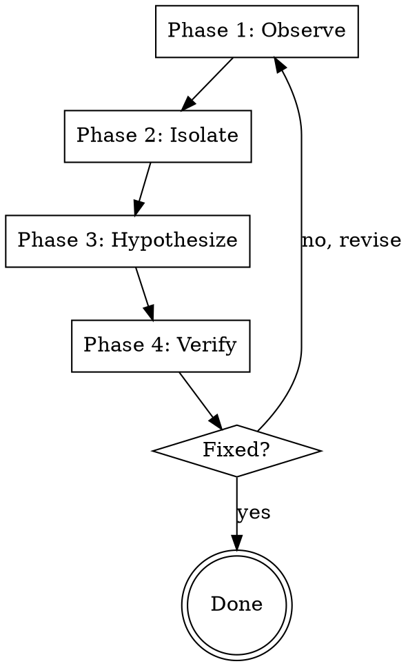

# Systematic Debugging

## Overview

This skill provides a 4-phase systematic approach to debugging that prevents random guessing and ensures you actually understand and fix the root cause of problems.

**Announce at start:** "I'm using the systematic-debugging skill. Following the 4-phase process."

<HARD-GATE>
Do NOT apply random fixes without understanding the root cause. Each fix must be driven by evidence and testing.
</HARD-GATE>

## The 4-Phase Process



## Phase 1: Observe

### Goal
Gather accurate, detailed information about the problem.

### Checklist
- [ ] Reproduce the issue consistently
- [ ] Document exact error messages
- [ ] Capture logs/stack traces
- [ ] Identify when it started (if regression)
- [ ] Note the environment/context
- [ ] Record reproduction steps

### Actions

**1. Reproduce the Bug**
- Try to reproduce consistently
- Document exact steps
- Note any conditions that affect reproduction

**2. Capture Evidence**
- Save error messages
- Copy stack traces
- Record log output
- Take screenshots if relevant

**3. Use LingFlow Code Analysis**
```bash
# Analyze the codebase for clues
python -c "
from lingflow.code_analyzer import CodeAnalyzer
analyzer = CodeAnalyzer('.')
analyzer.analyze_dimensions(['error_handling', 'edge_cases'])
"
```

### What to Document

- **Error**: Exact error message
- **Location**: File:line where it occurs
- **Context**: What was happening
- **Reproduction**: Steps to reproduce
- **Environment**: OS, version, configuration

## Phase 2: Isolate

### Goal
Narrow down the problem to a specific component or area.

### Checklist
- [ ] Identify the exact failure point
- [ ] Determine the affected component
- [ ] Find the smallest reproducible case
- [ ] Test in isolation (if possible)
- [ ] Eliminate unrelated variables

### Actions

**1. Binary Search the Codebase**
- Comment out half the code
- Does the bug still occur?
- Narrow down to the problematic section

**2. Test Components in Isolation**
```python
# Test individual functions
result = function_under_test()
print(f"Result: {result}")
```

**3. Use Conditional Breakpoints**
- Set breakpoints at suspected locations
- Add conditions to break only on specific inputs
- Inspect state at each step

**4. Verify Dependencies**
- Check if external APIs are failing
- Verify database connectivity
- Test network calls

## Phase 3: Hypothesize

### Goal
Form specific, testable hypotheses about the root cause.

### Checklist
- [ ] Propose 1-3 specific hypotheses
- [ ] Explain why each hypothesis fits the evidence
- [ ] Prioritize hypotheses by likelihood
- [ ] Design tests to validate each hypothesis

### Actions

**1. Analyze Evidence**
- Look at error messages
- Review stack traces
- Check for common patterns
- Consider recent changes

**2. Form Hypotheses**
Based on evidence, propose specific causes:

```
Hypothesis 1: Null pointer dereference
Evidence: TypeError: Cannot read property 'x' of null
Likelihood: High
Test: Add null check before property access

Hypothesis 2: Async race condition
Evidence: Intermittent failure, only under load
Likelihood: Medium
Test: Add delays, check execution order

Hypothesis 3: Configuration mismatch
Evidence: Works in dev, fails in prod
Likelihood: High
Test: Compare configs, use production config locally
```

**3. Prioritize**
Focus on the most likely hypothesis first.

## Phase 4: Verify

### Goal
Test each hypothesis with specific, reproducible tests.

### Checklist
- [ ] Create a minimal test case
- [ ] Add logging to validate hypothesis
- [ ] Apply the fix (if hypothesis confirmed)
- [ ] Verify the fix resolves the issue
- [ ] Run regression tests
- [ ] Ensure no side effects

### Actions

**1. Create Test Case**
```python
def test_hypothesis_1():
    """
    Test: Verify null pointer hypothesis
    Expected: Error occurs with None input
    """
    result = function_under_test(None)
    # Should throw specific error
```

**2. Add Logging**
```python
def function_under_test(data):
    print(f"DEBUG: Input data = {data}")
    print(f"DEBUG: Data type = {type(data)}")
    # ... rest of function
```

**3. Apply Fix**
Once hypothesis is confirmed, apply targeted fix.

**4. Verify Fix**
```bash
# Run the reproduction case
python reproduce_bug.py

# Run full test suite
python -m pytest

# Use LingFlow test engine
python comprehensive_test_runner.py
```

## LingFlow Integration

This skill integrates with LingFlow's existing capabilities:

### Code Analysis

Use LingFlow's code analyzer to understand the codebase:

```python
from lingflow.code_analyzer import CodeAnalyzer

analyzer = CodeAnalyzer('.')
report = analyzer.analyze_dimensions([
    'error_handling',
    'edge_cases',
    'code_quality'
])
```

### Comprehensive Testing

After fixing, run LingFlow's comprehensive test suite:

```bash
# Full test suite
python end_to_end_test_engine.py

# Specific dimensions
python comprehensive_test_runner.py --dimensions functionality,stability

# Quick verification
python 12_seconds_test_engine_demo.py
```

### Root Cause Analysis

LingFlow provides advanced debugging capabilities:

```python
from lingflow.debugger import RootCauseTracer

tracer = RootCauseTracer()
tracer.trace_error(error, context)
# Provides detailed analysis of how error occurred
```

## Debugging Techniques

### 1. Condition-Based Waiting

For intermittent bugs:

```python
import time

def wait_for_condition(condition_func, timeout=30):
    """
    Wait for condition to become true
    Useful for debugging race conditions
    """
    start = time.time()
    while time.time() - start < timeout:
        if condition_func():
            return True
        time.sleep(0.1)
    raise TimeoutError("Condition not met")
```

### 2. Defense in Depth

Add multiple validation layers:

```python
def process_data(data):
    # Layer 1: Input validation
    if not isinstance(data, dict):
        raise ValueError("Data must be dict")

    # Layer 2: Null checks
    if data.get('id') is None:
        raise ValueError("ID required")

    # Layer 3: Business logic validation
    if not is_valid_id(data['id']):
        raise ValueError("Invalid ID format")

    # Process data
    return transform(data)
```

### 3. Root Cause Tracing

Trace errors back to their source:

```python
def trace_error():
    import traceback
    import sys

    exc_info = sys.exc_info()
    traceback.print_exception(*exc_info)

    # Or use LingFlow's tracer
    from lingflow.debugger import RootCauseTracer
    tracer = RootCauseTracer()
    tracer.trace(exc_info)
```

## Common Bug Patterns

### 1. Null/Undefined References

**Symptoms**: TypeError: Cannot read property X of null/undefined

**Solution**:
```javascript
// Bad
const name = user.name.toLowerCase();

// Good
const name = user?.name?.toLowerCase() || '';
```

### 2. Async Race Conditions

**Symptoms**: Intermittent failures, only under load

**Solution**:
```javascript
// Use async/await properly
async function fetchData() {
  const data = await fetch(url);
  const json = await data.json();
  return json;
}

// Add proper error handling
try {
  const result = await fetchData();
} catch (error) {
  console.error('Fetch failed:', error);
}
```

### 3. Configuration Mismatches

**Symptoms**: Works in dev, fails in production

**Solution**:
```bash
# Compare configs
diff dev.config.json prod.config.json

# Use production config locally
cp prod.config.json local.config.json
```

### 4. Memory Leaks

**Symptoms**: Slowdown over time, high memory usage

**Solution**:
```python
# Use weak references for caches
import weakref

cache = weakref.WeakValueDictionary()

# Or use LRU cache
from functools import lru_cache

@lru_cache(maxsize=128)
def expensive_function(x):
    # ... computation
```

## Verification Before Completion

After fixing, ALWAYS verify:

1. **Original issue is resolved**
   - Reproduce the bug
   - Confirm it's fixed

2. **No regressions**
   - Run full test suite
   - Check related functionality

3. **No side effects**
   - Review changed code
   - Test edge cases

4. **Root cause addressed**
   - Not just symptoms
   - Fix prevents recurrence

## Example Debugging Session

```
Developer: "The login function sometimes fails with a timeout"

LingFlow (systematic-debugging):
"Let me follow the 4-phase process.

Phase 1: Observe
- Can you reproduce the issue consistently?
- What's the exact error message?
- When did it start happening?"

[Developer provides details]

"Phase 2: Isolate
I'll test the login function in isolation and narrow down the failure point."

[Test isolates the timeout to database query]

"Phase 3: Hypothesize
Based on the evidence, I have 3 hypotheses:

1. Database connection pool exhausted (High likelihood)
2. Slow query due to missing index (Medium likelihood)
3. Network connectivity issue (Low likelihood)

Let me test Hypothesis 1 first."

[Adds logging, tests connection pool]

"Phase 4: Verify
Hypothesis 1 confirmed. The connection pool is exhausted under load.

Applying fix:
- Increase pool size
- Add connection timeout
- Implement connection retry logic

Verifying fix...
[Runs tests, confirms no timeout]
[Runs regression tests, no issues]
[Runs LingFlow comprehensive tests, all pass]

Bug fixed! Root cause was connection pool exhaustion.
The fix prevents recurrence."
```

## Resources

- LingFlow comprehensive test architecture: `COMPREHENSIVE_TEST_ARCHITECTURE.md`
- Root cause tracing: `skills/systematic-debugging/root-cause-tracing.md`
- Defense in depth: `skills/systematic-debugging/defense-in-depth.md`
- Condition-based waiting: `skills/systematic-debugging/condition-based-waiting.md`
