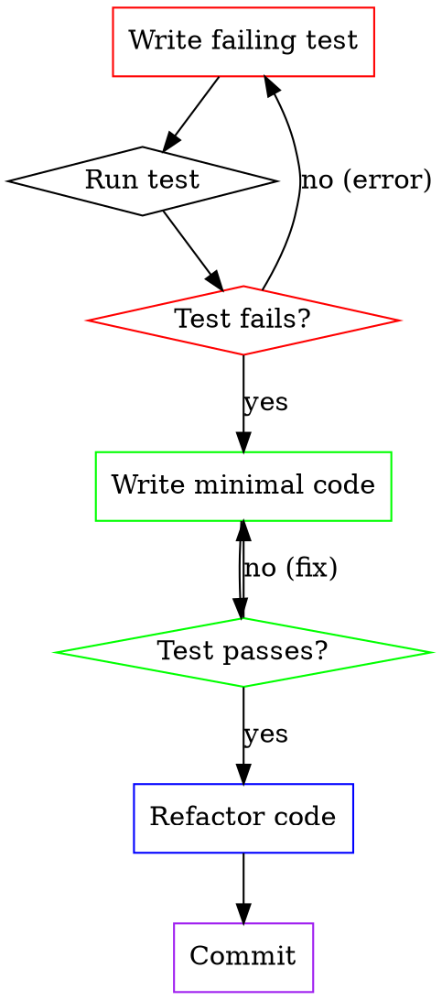

# Test Driven Development

## Overview

This skill enforces strict TDD practice. You MUST follow the RED-GREEN-REFACTOR cycle for every implementation:

1. **RED**: Write a failing test
2. **GREEN**: Write minimal code to make it pass
3. **REFACTOR**: Clean up the code (if needed)
4. **COMMIT**: Commit the working code

**Announce at start:** "I'm using the test-driven-development skill. Following RED-GREEN-REFACTOR cycle."

<HARD-GATE>
Do NOT write any implementation code before writing the test for it. Do NOT move to the next feature until the current feature is tested and working.
</HARD-GATE>

## The TDD Cycle



## Checklist

For each feature/function you implement:

1. **Write the test** - Describe the expected behavior
2. **Run the test** - Verify it fails (RED)
3. **Write implementation** - Minimal code to pass
4. **Run the test** - Verify it passes (GREEN)
5. **Refactor** - Improve code without changing behavior (if needed)
6. **Run all tests** - Verify nothing broke
7. **Commit** - Save the working code

## Step-by-Step Process

### Step 1: Write the Test

- Write a test that clearly describes the behavior you want
- The test should be specific and focused
- Use descriptive test names: `should return user when id exists`

### Step 2: Run the Test (RED)

- Run the test and verify it fails
- The failure should be meaningful (not a syntax error)
- If the test doesn't fail, either:
  - The code already exists (write a different test)
  - The test is incorrect (fix it)
- **Do NOT proceed until the test fails**

### Step 3: Write Minimal Code

- Write the MINIMAL code to make the test pass
- Don't add extra features (YAGNI)
- Don't optimize prematurely
- Focus on making the test pass, nothing more

### Step 4: Run the Test (GREEN)

- Run the test and verify it passes
- If it fails, fix the code and try again
- **Do NOT proceed until the test passes**

### Step 5: Refactor (Optional)

- Review the code for improvements
- Apply DRY principles
- Improve readability
- Rename variables for clarity
- **Run all tests** to ensure nothing broke

### Step 6: Run All Tests

- Run the full test suite
- Verify no regressions
- If any test fails, fix it before proceeding

### Step 7: Commit

- Commit the working code
- Use clear, descriptive commit messages
- Commit after each feature is complete

## LingFlow Integration

This skill works seamlessly with LingFlow's comprehensive test engine:

### Using LingFlow Test Engine

When running tests, prefer LingFlow's test engine for comprehensive coverage:

```bash
# Run LingFlow comprehensive tests
python end_to_end_test_engine.py

# Run specific test dimensions
python comprehensive_test_runner.py --dimensions functionality,performance

# Quick 12-second tests
python 12_seconds_test_engine_demo.py
```

### Test Categories

LingFlow's test engine covers:

1. **Functionality Tests** - Core behavior verification
2. **Performance Tests** - Speed and efficiency
3. **Compatibility Tests** - Platform and version compatibility
4. **Security Tests** - Vulnerability detection
5. **Stability Tests** - Error handling and edge cases
6. **Usability Tests** - User experience
7. **Maintainability Tests** - Code quality
8. **Integration Tests** - Component interaction
9. **Documentation Tests** - Documentation accuracy

### Writing LingFlow-Compatible Tests

Structure your tests to be compatible with LingFlow's test runner:

```python
def test_user_authentication():
    """
    Test: User authentication with valid credentials
    Dimensions: functionality, security
    """
    # Arrange
    username = "testuser"
    password = "testpass"

    # Act
    result = authenticate(username, password)

    # Assert
    assert result.success == True
    assert result.token is not None

    # LingFlow metadata
    test_metadata = {
        "dimensions": ["functionality", "security"],
        "category": "authentication",
        "priority": "high"
    }
```

## Anti-Patterns

### ❌ Writing Tests After Code

This defeats the purpose of TDD. You end up testing what the code does, not what it should do.

### ❌ Writing Too Much Code at Once

Write one test, implement it, commit. Then move to the next test.

### ❌ Skipping the "Red" Phase

You must verify the test fails before implementing. This catches bad tests.

### ❌ Not Running All Tests

Always run the full test suite after each change to catch regressions.

### ❌ Committing Broken Code

Only commit when tests pass.

## Example Workflow

```
Developer: "I need to add a function to validate email addresses"

LingFlow (TDD):
"Let me write a test first."

[Step 1: Write failing test]
```python
def test_validate_email():
    result = validate_email("user@example.com")
    assert result == True
```

[Step 2: Run test]
Run: `pytest tests/email.test.py`
Result: FAIL - "validate_email is not defined"
✓ RED

[Step 3: Write minimal code]
```python
def validate_email(email):
    return "@" in email
```

[Step 4: Run test]
Run: `pytest tests/email.test.py`
Result: PASS
✓ GREEN

[Step 5: Refactor - skip, code is simple enough]

[Step 6: Run all tests]
Run: `pytest`
Result: All tests pass
✓

[Step 7: Commit]
git add email.py tests/email.test.py
git commit -m "feat: add email validation"
✓ Committed

"Email validation complete and tested. Ready for next feature."
```

## Test Quality Guidelines

### Good Tests

- Are independent (don't depend on other tests)
- Are fast (execute in seconds)
- Are readable (describe what they test)
- Are specific (test one thing)
- Are deterministic (always same result)
- Have clear assertions

### Bad Tests

- Test implementation details (test behavior, not internals)
- Are brittle (break easily)
- Are slow (take minutes or hours)
- Are confusing (hard to understand)
- Are dependent (require other tests to run first)

## When to Break the Rules

Rare exceptions where you might not follow strict TDD:

- **Exploratory coding**: When you don't know the API yet
- **Bug fixes**: Write a test that reproduces the bug, then fix
- **Refactoring**: Existing code without tests - add tests first

Even in these cases, write tests as soon as possible.

## Resources

- LingFlow comprehensive test architecture: `COMPREHENSIVE_TEST_ARCHITECTURE.md`
- 12-second testing technique: `12_SECONDS_TESTING_TECHNIQUE.md`
- Testing anti-patterns: `skills/test-driven-development/testing-anti-patterns.md`
