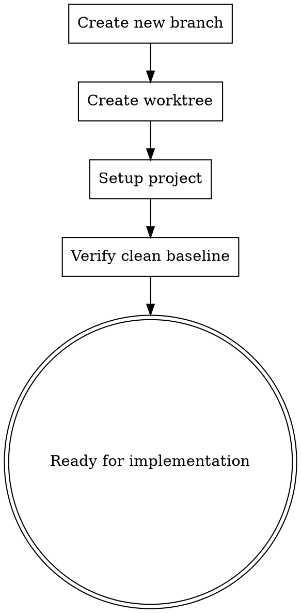

# Using Git Worktrees

## Overview

This skill ensures you have an isolated workspace for feature development using Git worktrees. This enables safe parallel development without switching branches in your main workspace.

**Announce at start:** "I'm using the using-git-worktrees skill. Setting up isolated workspace."

<HARD-GATE>
Do NOT start implementation work until you have a dedicated worktree set up. Never work directly in the main branch or with multiple features in the same workspace.
</HARD-GATE>

## Why Worktrees?

Traditional Git workflow requires switching branches in a single workspace:

```bash
git checkout feature-a
# Work on feature A
git checkout feature-b
# Work on feature B (must stash or commit A changes)
```

**Problems**:
- Must commit or stash before switching
- Can't work on multiple features simultaneously
- Risk of mixing changes
- Context switching overhead

**Git Worktrees** solve this:
```bash
git worktree add ../feature-a feature-a
git worktree add ../feature-b feature-b
# Work on both simultaneously in separate directories
```

## Process Flow



## Checklist

1. **Create feature branch** from main/develop
2. **Create worktree** with descriptive location
3. **Setup project** (install dependencies, configure)
4. **Verify tests pass** (clean baseline)
5. **Lock worktree location** (add to .git/info/exclude if needed)

## Step-by-Step Process

### Step 1: Create Feature Branch

Create a new branch for the feature:

```bash
# Ensure main/develop is up to date
git checkout main
git pull origin main

# Create new feature branch
git checkout -b feature/<feature-name>
```

**Branch Naming Convention**:
- `feature/<name>` - New features
- `fix/<name>` - Bug fixes
- `refactor/<name>` - Refactoring
- `docs/<name>` - Documentation

### Step 2: Create Worktree

Create a worktree in a separate location:

```bash
# Create worktree parallel to main repo
git worktree add ../<project>-<feature> feature/<feature-name>

# Example
git worktree add ../lingflow-auth feature/user-authentication
```

**Worktree Location Guidelines**:
- Use descriptive names
- Keep worktrees organized (e.g., in `../worktrees/`)
- Avoid deep nesting (max 2-3 levels)
- Use consistent naming convention

### Step 3: Navigate to Worktree

```bash
cd ../<project>-<feature>
```

You now have an isolated workspace:
- Separate working directory
- Same Git repository
- Different branch
- Can work independently

### Step 4: Setup Project

Run project setup in the worktree:

```bash
# Install dependencies
npm install
# or
pip install -r requirements.txt

# Configure environment
cp .env.example .env
# Edit .env as needed

# Run database migrations
npm run migrate
# or
python manage.py migrate

# Verify setup
npm run setup:verify
# or
python setup.py verify
```

### Step 5: Verify Clean Baseline

Run tests to ensure clean starting point:

```bash
# Run full test suite
npm test
# or
pytest

# Run LingFlow comprehensive tests
python comprehensive_test_runner.py

# Verify no issues
python end_to_end_test_engine.py
```

**Expected Outcome**:
- All tests pass
- No lint errors
- Clean baseline to work from

If tests fail, fix them in the main branch first.

## Worktree Management

### List Worktrees

```bash
git worktree list
```

Example output:
```
/home/ai/zhineng-knowledge-system/lingflow        1a2b3c4 [main]
/home/ai/zhineng-knowledge-system/lingflow-auth  5d6e7f8 [feature/user-authentication]
/home/ai/zhineng-knowledge-system/lingflow-api   9a0b1c2 [feature/api-v2]
```

### Remove Worktree

```bash
# Navigate out of worktree first
cd ~/path/to/main/repo

# Remove worktree
git worktree remove ../lingflow-auth

# Or remove and delete working directory
git worktree remove ../lingflow-auth --force
```

### Prune Worktrees

Remove worktree references for deleted directories:

```bash
git worktree prune
```

### Move Worktree

```bash
git worktree move <old-path> <new-path>
```

## Worktree Best Practices

### ✅ DO

- Use descriptive branch names
- Use descriptive worktree locations
- Keep worktrees organized
- Clean up worktrees when done
- Run tests after setup
- Document worktree location

### ❌ DON'T

- Work directly in main branch
- Mix multiple features in one worktree
- Delete worktree directories manually
- Create worktrees too deep
- Skip baseline verification
- Leave old worktrees around

## LingFlow Integration

### Worktree with LingFlow Skills

Worktrees integrate seamlessly with LingFlow's skill system:

```
[brainstorming skill]
  ↓ Design approved
  ↓
[using-git-worktrees skill]
  ↓ Worktree created and ready
  ↓
[writing-plans skill]
  ↓ Plan created
  ↓
[subagent-driven-development skill]
  ↓ Implementation complete
  ↓
[finishing-a-development-branch skill]
  ↓ Tests pass, ready to merge
  ↓
[Worktree removed]
```

### Worktree Location Tracking

Track worktree locations in your project:

```bash
# Add to .git/info/exclude
echo "../worktrees/*" >> .git/info/exclude
```

Or create a worktrees directory:

```bash
mkdir -p worktrees
git worktree add worktrees/user-authentication feature/user-authentication
```

## Common Issues and Solutions

### Issue: "fatal: worktree at <path> already exists"

**Cause**: Worktree location already exists

**Solution**:
```bash
# Remove old worktree
git worktree remove <path>

# Or use different location
git worktree add <different-path> <branch>
```

### Issue: Tests fail after worktree setup

**Cause**: Dependencies not installed or environment not configured

**Solution**:
```bash
# Reinstall dependencies
rm -rf node_modules
npm install

# Or for Python
pip install -r requirements.txt --force-reinstall
```

### Issue: Can't remove worktree

**Cause**: Currently in the worktree directory

**Solution**:
```bash
# Navigate to main repo
cd ~/path/to/main/repo

# Then remove
git worktree remove <worktree-path>
```

## Example Session

```
Developer: "I want to work on user authentication feature"

LingFlow (using-git-worktrees):
"Setting up isolated workspace for user authentication...

Step 1: Creating feature branch
✓ Created branch: feature/user-authentication

Step 2: Creating worktree
✓ Created worktree: ../lingflow-auth
  Location: /home/ai/zhineng-knowledge-system/lingflow-auth
  Branch: feature/user-authentication

Step 3: Setting up project
✓ Installed dependencies (234 packages)
✓ Configured environment (.env created)
✓ Ran migrations (12 migrations applied)

Step 4: Verifying clean baseline
Running tests...
✓ Unit tests: 142 passed, 0 failed
✓ Integration tests: 89 passed, 0 failed
✓ LingFlow comprehensive tests: All dimensions pass
✓ Clean baseline confirmed

✅ Workspace ready!
Location: ../lingflow-auth
Branch: feature/user-authentication

You can now start implementation in the isolated workspace.
After completion, use finishing-a-development-branch skill to merge."
```

## Cleanup Workflow

When finished with a worktree:

```bash
# Navigate to main repo
cd ~/path/to/main/repo

# Remove worktree
git worktree remove ../lingflow-auth

# Remove branch (after merge)
git branch -d feature/user-authentication
```

## Resources

- Git Worktrees Documentation: https://git-scm.com/docs/git-worktree
- LingFlow comprehensive test architecture: `COMPREHENSIVE_TEST_ARCHITECTURE.md`
