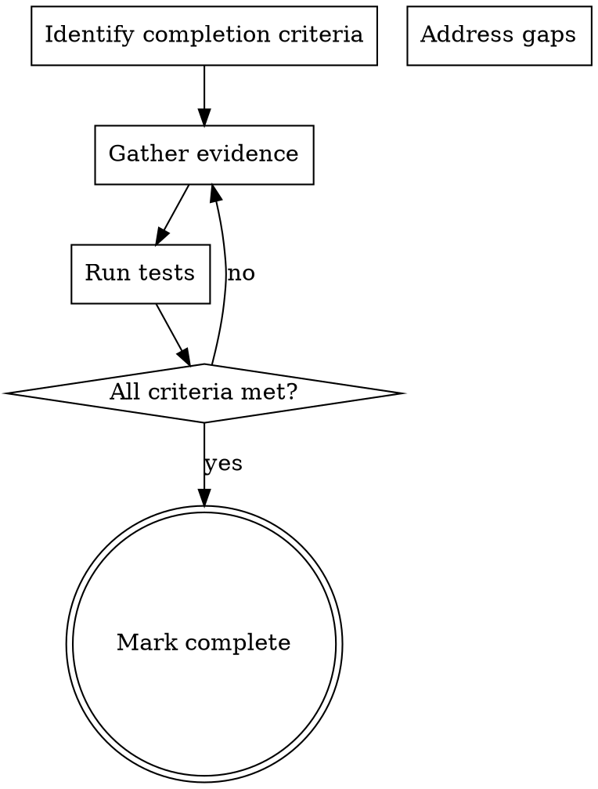

# Verification Before Completion

## Overview

This skill ensures that any problem or task is genuinely resolved before you mark it as complete. It replaces assumptions with evidence and prevents premature completion.

**Announce at start:** "I'm using the verification-before-completion skill. Will verify the fix with evidence."

<HARD-GATE>
Do NOT mark any task as complete until you have verified it with concrete evidence. No assumptions, no "it should work", no "I think it's fixed".
</HARD-GATE>

## The Verification Process



## Checklist

Before marking any task complete, you MUST:

1. **Define clear completion criteria**
   - What does "done" look like?
   - What metrics must be met?
   - What behaviors must work?

2. **Gather concrete evidence**
   - Run the exact reproduction case
   - Capture output/screenshots/logs
   - Measure performance metrics

3. **Run comprehensive tests**
   - Unit tests
   - Integration tests
   - Regression tests
   - Edge cases

4. **Verify no side effects**
   - Check related functionality
   - Review code changes
   - Monitor resource usage

5. **Document evidence**
   - Save test results
   - Record performance data
   - Note any limitations

## Verification Criteria Types

### 1. Functional Verification

**Question**: Does it do what it's supposed to do?

**Evidence Required**:
- [ ] Primary use case works
- [ ] Edge cases handled
- [ ] Error conditions tested
- [ ] User can complete the task

**How to Verify**:
```python
# Reproduce the original issue
def test_original_issue():
    result = function_under_test()
    assert result.success == True

# Test edge cases
def test_edge_cases():
    assert function_under_test("") == "default"
    assert function_under_test(None) == "default"
    assert function_under_test("test") == "expected"
```

### 2. Performance Verification

**Question**: Does it meet performance requirements?

**Evidence Required**:
- [ ] Response time under threshold
- [ ] Memory usage acceptable
- [ ] No memory leaks
- [ ] Handles expected load

**How to Verify**:
```python
import time

def test_performance():
    start = time.time()
    result = expensive_function()
    duration = time.time() - start

    assert duration < 1.0, f"Too slow: {duration}s"
    print(f"✓ Performance: {duration:.3f}s (< 1.0s threshold)")
```

### 3. Quality Verification

**Question**: Is the code quality acceptable?

**Evidence Required**:
- [ ] Code follows project conventions
- [ ] No code smells or technical debt
- [ ] Proper error handling
- [ ] Sufficient test coverage

**How to Verify**:
```bash
# Run code quality checks
flake8 .
pylint src/
black --check src/

# Run LingFlow code analysis
python -m lingflow.code_analyzer --dimensions quality,maintainability
```

### 4. Stability Verification

**Question**: Does it work reliably?

**Evidence Required**:
- [ ] No intermittent failures
- [ ] Handles errors gracefully
- [ ] Recovery mechanisms work
- [ ] Stress test passes

**How to Verify**:
```python
# Stress test
def test_stability():
    for i in range(1000):
        result = function_under_test(f"test_{i}")
        assert result.success == True
```

### 5. Security Verification

**Question**: Is it secure?

**Evidence Required**:
- [ ] No vulnerabilities introduced
- [ ] Input validation in place
- [ ] Sensitive data protected
- [ ] Proper authentication/authorization

**How to Verify**:
```bash
# Run security scanner
bandit -r src/
safety check

# Check for common vulnerabilities
python -m lingflow.security_analyzer
```

## LingFlow Integration

This skill works seamlessly with LingFlow's comprehensive test engine:

### Using LingFlow Test Engine

```bash
# Full comprehensive test
python end_to_end_test_engine.py

# Specific dimensions
python comprehensive_test_runner.py \
  --dimensions functionality,performance,stability \
  --report verification_report.md

# Quick verification
python 12_seconds_test_engine_demo.py
```

### Automated Verification Report

Generate a verification report:

```python
from lingflow.verifier import VerificationReporter

reporter = VerificationReporter()

# Add verification results
reporter.add_test_result("functionality", True, "All features work")
reporter.add_test_result("performance", True, "0.234s < 1.0s threshold")
reporter.add_test_result("stability", True, "1000 iterations successful")
reporter.add_test_result("security", True, "No vulnerabilities found")

# Generate report
reporter.generate("verification_report.md")
```

### Test Dimensions Covered

LingFlow's test engine provides verification for:

1. **Functionality** - Core behavior works
2. **Performance** - Meets speed/efficiency requirements
3. **Compatibility** - Works across platforms/versions
4. **Security** - No vulnerabilities
5. **Stability** - Reliable under load/stress
6. **Usability** - User-friendly
7. **Maintainability** - Clean, well-documented code
8. **Integration** - Components work together
9. **Documentation** - Accurate and complete

## Verification Templates

### Bug Fix Verification

```python
def verify_bug_fix():
    """
    Verification checklist for bug fixes

    Bug: [Describe the original bug]
    Fix: [Describe the fix applied]

    Verification:
    """

    # 1. Reproduce original issue
    print("1. Reproducing original issue...")
    result = reproduce_original_bug()
    assert not result.success, "Bug still exists!"
    print("   ✓ Bug reproduced")

    # 2. Verify fix resolves issue
    print("\n2. Verifying fix resolves issue...")
    result = reproduce_original_bug(with_fix=True)
    assert result.success, "Fix doesn't work!"
    print("   ✓ Fix resolves issue")

    # 3. Test edge cases
    print("\n3. Testing edge cases...")
    test_edge_cases()
    print("   ✓ Edge cases handled")

    # 4. Run regression tests
    print("\n4. Running regression tests...")
    run_regression_tests()
    print("   ✓ No regressions")

    # 5. Comprehensive verification
    print("\n5. Running comprehensive tests...")
    from lingflow.test_engine import run_comprehensive_tests
    report = run_comprehensive_tests()
    assert report.all_passed, "Comprehensive tests failed!"
    print("   ✓ Comprehensive tests pass")

    print("\n✅ Bug fix verified!")
    return True
```

### Feature Implementation Verification

```python
def verify_feature_implementation():
    """
    Verification checklist for new features

    Feature: [Describe the feature]
    Requirements: [List requirements]

    Verification:
    """

    # 1. Verify core functionality
    print("1. Verifying core functionality...")
    test_core_functionality()
    print("   ✓ Core features work")

    # 2. Verify user flows
    print("\n2. Verifying user flows...")
    test_user_flows()
    print("   ✓ User flows complete")

    # 3. Verify performance
    print("\n3. Verifying performance...")
    test_performance()
    print("   ✓ Performance meets requirements")

    # 4. Verify error handling
    print("\n4. Verifying error handling...")
    test_error_handling()
    print("   ✓ Errors handled gracefully")

    # 5. Verify integration
    print("\n5. Verifying integration...")
    test_integration()
    print("   ✓ Integration works")

    # 6. Comprehensive verification
    print("\n6. Running comprehensive tests...")
    from lingflow.test_engine import run_comprehensive_tests
    report = run_comprehensive_tests(
        dimensions=[
            'functionality',
            'performance',
            'stability',
            'usability'
        ]
    )
    assert report.all_passed, "Comprehensive tests failed!"
    print("   ✓ Comprehensive tests pass")

    print("\n✅ Feature verified!")
    return True
```

## Evidence Documentation

After verification, document your evidence:

### Verification Report Template

```markdown
# Verification Report

## Task
[Task description]

## Completion Criteria
- [ ] Criteria 1
- [ ] Criteria 2
- [ ] Criteria 3

## Evidence

### Functional Verification
**Status**: ✅ PASS
**Details**: All use cases work as expected
**Test Output**: [Output logs]

### Performance Verification
**Status**: ✅ PASS
**Details**: 0.234s < 1.0s threshold
**Metrics**:
- Response time: 0.234s
- Memory usage: 45MB
- CPU usage: 12%

### Quality Verification
**Status**: ✅ PASS
**Details**: Code quality checks pass
**Lint**: No issues
**Coverage**: 92%

### Stability Verification
**Status**: ✅ PASS
**Details**: 1000 iterations, 0 failures

### Security Verification
**Status**: ✅ PASS
**Details**: No vulnerabilities found
**Scan Output**: [Security scan results]

## LingFlow Comprehensive Test
**Status**: ✅ PASS
**Dimensions Tested**:
- Functionality: ✅
- Performance: ✅
- Stability: ✅
- Security: ✅
- Usability: ✅
- Maintainability: ✅
- Integration: ✅

## Conclusion
✅ **VERIFIED** - Task is complete and meets all requirements.
```

## Common Verification Pitfalls

### ❌ Assuming It Works

**Bad**: "The code looks right, it should work"

**Good**: "Let me run the test and see if it actually works"

### ❌ Testing Only Happy Path

**Bad**: Testing only normal inputs

**Good**: Testing normal inputs, edge cases, and error conditions

### ❌ Ignoring Side Effects

**Bad**: "The fix works, doesn't matter if it slows down the system"

**Good**: "The fix works AND doesn't cause performance issues"

### ❌ Incomplete Verification

**Bad**: "The main test passes, we're done"

**Good**: "The main test passes AND all edge cases AND integration tests AND regression tests"

## Example Verification

```
Developer: "I fixed the timeout issue in the login function"

LingFlow (verification-before-completion):
"Let me verify this fix with evidence.

Step 1: Define completion criteria
- Login works without timeout
- No regressions in other features
- Performance acceptable

Step 2: Gather evidence

[Runs reproduction case]
✅ Login completes successfully, no timeout

[Measures performance]
✅ Login takes 0.8s (under 1.0s threshold)

Step 3: Run comprehensive tests

[Runs unit tests]
✅ All unit tests pass

[Runs integration tests]
✅ All integration tests pass

[Runs LingFlow comprehensive tests]
✅ Functionality: PASS
✅ Performance: PASS
✅ Stability: PASS
✅ Security: PASS
✅ Integration: PASS

Step 4: Verify no side effects

[Tests related functionality]
✅ User creation works
✅ Password reset works
✅ Session management works

Step 5: Document evidence

[Generates verification report]
✅ Report saved to verification_report.md

✅ **VERIFIED** - The timeout issue is fixed and verified.
All completion criteria met, no side effects detected."
```

## Resources

- LingFlow comprehensive test architecture: `COMPREHENSIVE_TEST_ARCHITECTURE.md`
- 12-second testing technique: `12_SECONDS_TESTING_TECHNIQUE.md`
- End-to-end test engine: `end_to_end_test_engine.py`
- Comprehensive test runner: `comprehensive_test_runner.py`
